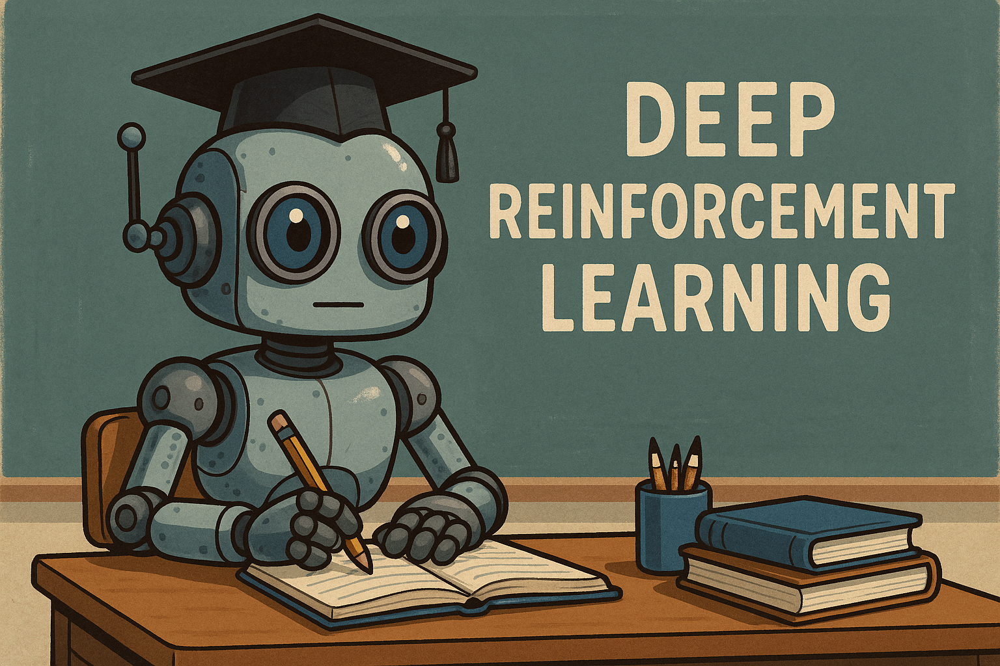

# CursoRL-YouTube

  

  <strong>Curso de Aprendizaje por Refuerzo de YouTube</strong>

## 🎮 Entornos de Aprendizaje

  <table>
    <tr>
      <td align="center">
        
         
        <strong>Breakout</strong>
      </td>
      <td align="center">
        
         
        <strong>DCQ</strong>
      </td>
    </tr>
    <tr>
      <td align="center">
        
         
        <strong>Ant</strong>
      </td>
      <td align="center">
        
         
        <strong>Half Cheetah</strong>
      </td>
    </tr>
  </table>

## 🧾 Licencia

El contenido de este repositorio está cubierto por dos licencias:

- **Código fuente y notebooks ejecutables:** [MIT License](./LICENSE-MIT)  
  Esto permite usar, modificar y redistribuir el código libremente, incluso en proyectos propios.

- **Material educativo, textos, figuras e imágenes:** [Creative Commons Attribution-NonCommercial 4.0 International (CC BY-NC 4.0)](./LICENSE-CC-BY-NC-4.0)  
  Puedes compartir y adaptar estos materiales siempre que des crédito y no los uses con fines comerciales.

© 2025 [Juan Terven](https://github.com/jrterven)